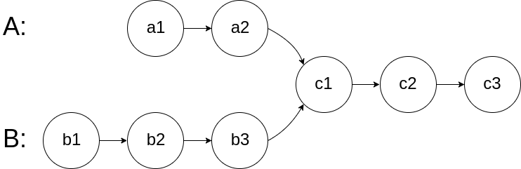

## 160. Intersection Of Linked Lists

Given the heads of two singly linked-lists <code>headA</code> and <code>headB</code>, return the node at which the two lists intersect. If the two linked lists have no intersection at all, return <code>null</code>.

For example, the following two linked lists begin to intersect at node <code>c1</code>:

The test cases are generated such that there are no cycles anywhere in the entire linked structure.

<b>Note</b> that the linked lists must <b>retain their original structure</b> after the function returns.